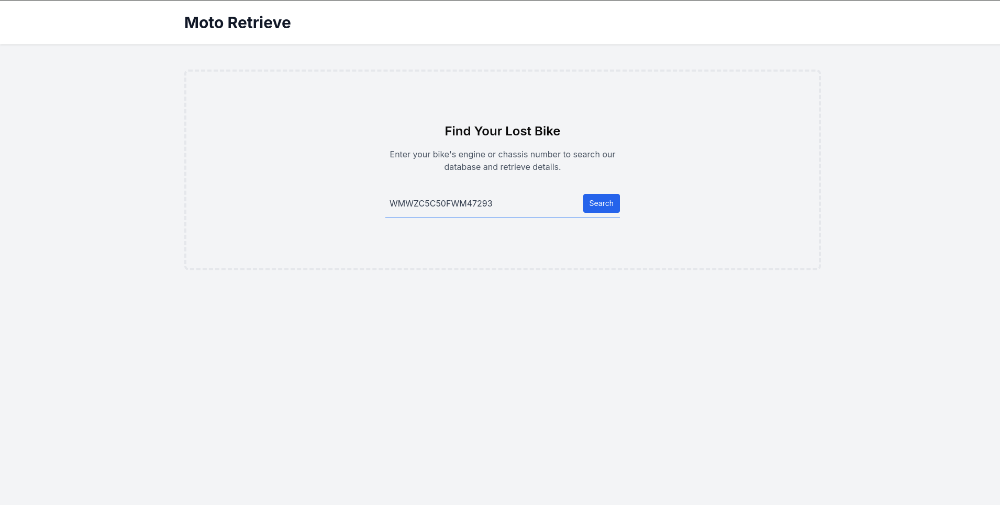
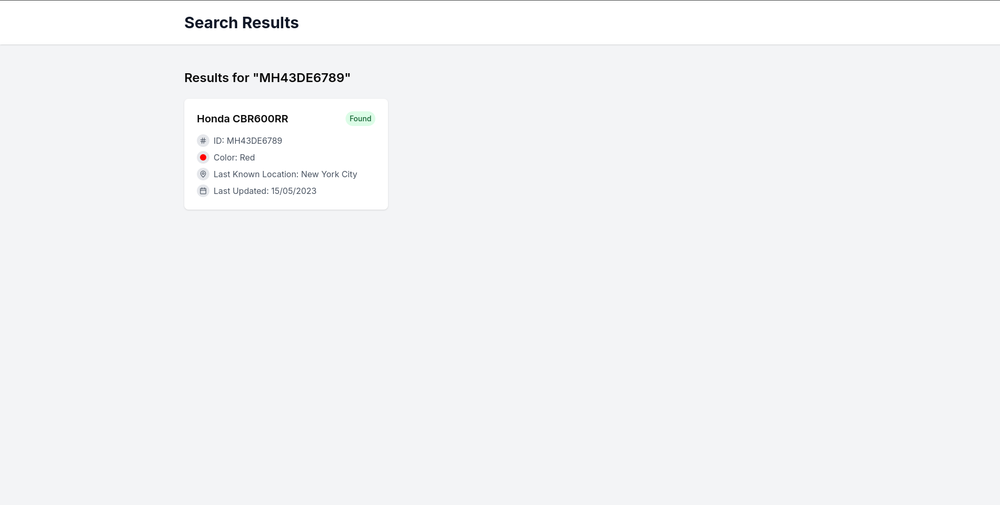

<!-- eslint-disable -->

# Moto Retrieve: Engine & Chassis Number Search for Lost Bike Identification

Moto Retrieve is a web application designed to help users search for lost bikes using their engine or chassis numbers. The platform provides a modern and user-friendly interface for search functionality, result display, and admin data management. This project uses a stack of **Next.js**, **Laravel**, **TypeScript**, and **TailwindCSS**.

## Table of Contents

1. [Features](#features)
2. [Tech Stack](#tech-stack)
3. [Setup and Installation](#setup-and-installation)
4. [File Structure](#file-structure)
5. [Usage](#usage)
6. [Contributing](#contributing)
7. [License](#license)

---

## Features

- **Search Engine**: Users can search for bike details using engine or chassis numbers.
- **Mock API Integration**: Fake API calls simulate real-world responses (success, error, and empty states).
- **Responsive Design**: Built with TailwindCSS to ensure mobile-friendly and visually appealing layouts.
- **Accessibility**: WCAG-compliant design for all users.
- **Future Expandability**: The app structure supports seamless integration with real APIs and databases.

---

## Tech Stack

### Frontend
- **Framework**: [Next.js](https://nextjs.org/)
- **Language**: [TypeScript](https://www.typescriptlang.org/)
- **Styling**: [TailwindCSS](https://tailwindcss.com/)

### Backend
- **Framework**: [Laravel](https://laravel.com/) (mocked for this prototype)
- **API**: Fake JSON endpoints via `fetch` or `axios`

---

## Setup and Installation

### Prerequisites
- Node.js >= 16.x
- npm >= 8.x / yarn >= 1.x
- PHP >= 8.x (if using Laravel backend locally)

### Clone the Repository
```bash
git clone https://github.com/<your-username>/moto-retrieve.git
cd moto-retrieve
```

### Install Dependencies
#### Frontend
```bash
cd frontend
npm install
```

#### Backend
If using Laravel locally:
```bash
cd backend
composer install
```

### Environment Variables
Create a `.env.local` file in the `frontend` directory with the following:
```env
NEXT_PUBLIC_API_URL=http://localhost:8000/api # Adjust as needed
```

If using Laravel:
1. Copy the `.env.example` file in the `backend` directory to `.env`.
2. Configure database and app keys:
   ```bash
   php artisan key:generate
   ```

### Run the Application
#### Frontend
```bash
cd frontend
npm run dev
```

#### Backend (optional)
```bash
cd backend
php artisan serve
```

Access the frontend at `http://localhost:3000`.

---

## File Structure

```plaintext
moto-retrieve/
├── frontend/
│   ├── components/         # Reusable UI components
│   ├── pages/              # Next.js pages and routes
│   ├── public/             # Static assets
│   ├── styles/             # Global and TailwindCSS files
│   └── utils/              # Helper functions (e.g., API calls)
├── backend/
│   ├── app/                # Laravel application files
│   ├── routes/             # API routes
│   ├── database/           # Seeders and migrations (mock data)
│   └── public/             # Laravel public assets
└── README.md
```

---

## Usage

### Search for Bike Details
1. Navigate to the homepage.
2. Enter an engine or chassis number into the search bar.
3. View search results or error messages.

### Simulating API Responses
Modify mock data in the `frontend/utils/mockData.json` file.

---

## Contributing

We welcome contributions! Follow these steps:
1. Fork the repository.
2. Create a new feature branch: `git checkout -b feature/your-feature-name`.
3. Commit your changes: `git commit -m "Add your feature"`.
4. Push to the branch: `git push origin feature/your-feature-name`.
5. Submit a pull request.

---

## License

This project is licensed under the [MIT License](LICENSE).

---

### Screenshots

#### Home Page


#### Search Results

``` 
